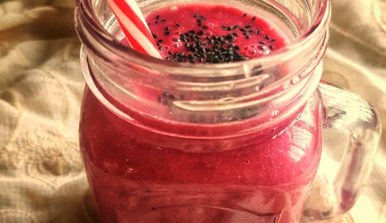

# Breakfast Smoothie

## Cooking Time

  - Preparation time: 2 minutes.
  - Cook time: 1 minute
  - Total time: 3 minutes.

## Ingredients

  - Yellow banana: 1 piece
  - Oats: 2 table spoons
  - Almond milk or Diary milk: 1/2 cup
  - Chickoo: 1 piece
  - Blueberry jam: 1 table spoon
  - Beetroot powder: 1 table spoon
  - Flax seed powder: 1 table spoon
  - Chia seeds: 1 table spoon

## Directions

  1. Blend together all the ingredients but the *chia seeds* into fine consistency.
  2. Top it with *chia seeds*.
  3. Serve.